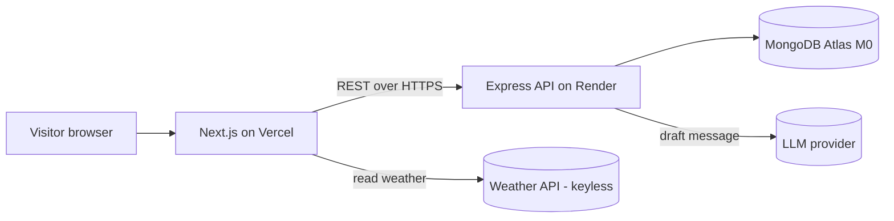
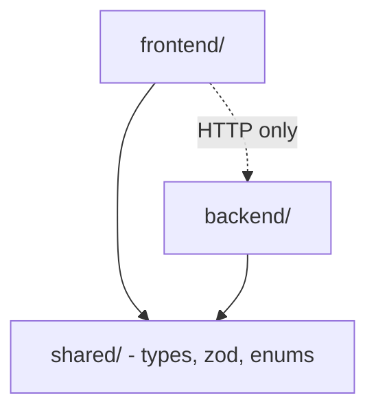
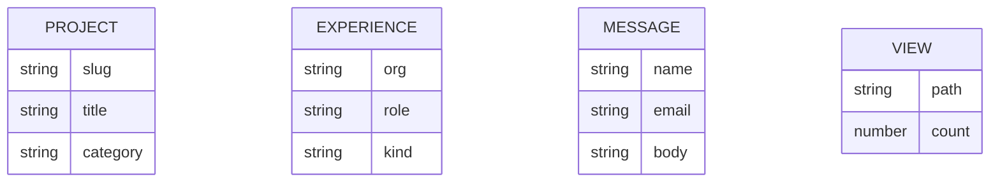

# Architecture Spine — Sagar's Portfolio

## Design Paradigm

**Layered monorepo.** Two deployables plus one shared contract, in one repo.

- **`frontend/`** — Next.js App Router. Segmented by **route groups**: `(site)` public pages, `(admin)` admin panel, each with its own layout under one root layout. Presentation and client state only; it never touches the database.
- **`backend/`** — **layered Express**: `routes → controllers → services → models`. A request flows down the layers; only `services` touch Mongoose, only `models` define schemas. Cross-cutting concerns (logging, validation, auth, rate-limit, error handling) are middleware.
- **`shared/`** — the canonical TypeScript domain contract (types, the API envelope, enums, Zod schemas) both sides compile against.

## Invariants & Rules

### AD-1 — Layered monorepo, fixed layer directions `[ADOPTED]`
- **Binds:** all
- **Prevents:** independently-built units inventing incompatible structure or reaching across layers
- **Rule:** Frontend code lives under `frontend/`, backend under `backend/`, shared contract under `shared/`. In the backend, dependencies flow one way only: `routes → controllers → services → models`; a `route` never queries Mongoose directly, a `model` never imports a `controller`.

### AD-2 — Backend is the sole owner of the database
- **Binds:** FR-5, FR-6, FR-10, FR-11, FR-12, FR-13
- **Prevents:** two writers to one collection; schema drift
- **Rule:** Only the Express backend connects to MongoDB. The frontend performs **all** reads and writes through the Express REST API over HTTP — never a direct DB connection, never Mongo credentials in the frontend.

### AD-3 — One API response envelope
- **Binds:** FR-10 and every endpoint
- **Prevents:** each endpoint inventing its own shape, breaking the client
- **Rule:** Success responses return `{ "data": ... }`; errors return `{ "error": { "message": string, "code": string } }` with a meaningful HTTP status. No endpoint returns a bare array or ad-hoc keys.

### AD-4 — Domain entities and identity
- **Binds:** FR-4, FR-5, FR-6, FR-13a
- **Prevents:** route/id ambiguity; duplicate identity strategies; slug collisions producing an ambiguous `/projects/[slug]`
- **Rule:** The domain is exactly `Project`, `Experience`, `Message`, `View`. `Project` carries a **unique `slug`** (kebab-case) that is the public route parameter (`/projects/[slug]`); Mongo `_id` is internal and never appears in a public URL. The **backend enforces slug uniqueness** (unique index) and, on collision at create/update, rejects the write or auto-derives a distinct slug — the frontend never assumes a slug is free.

### AD-5 — Read data is server-rendered; interactive data uses React Query
- **Binds:** FR-5, FR-6, FR-13b, FR-14, NFR-1
- **Prevents:** inconsistent fetching patterns; SEO/Lighthouse regressions from client-fetching public content; stale static pages after an admin edit
- **Rule:** Public read content (projects, experience) is rendered via Next.js **SSG/ISR** (`generateStaticParams`). Freshness has a named owner: **after a successful admin mutation the backend triggers Next.js on-demand revalidation** (revalidation webhook / tag), with a time-based `revalidate` as fallback — the static pages live on Vercel while writes happen on Render, so neither side may assume the other refreshes. Interactive/dynamic data — contact submit, admin CRUD, weather widget, AI draft — uses **React Query** hooks in client components. No public content is fetched client-side in a way that leaves it out of the initial HTML.
- **Note:** the weather widget may fetch client-side only because its API is **keyless** (e.g. Open-Meteo). A keyed weather provider must be proxied through the backend instead (per AD-7), never called from the client.

### AD-6 — Zod validation at the API boundary, schemas shared with forms
- **Binds:** FR-6, FR-10, FR-12, NFR-4
- **Prevents:** unvalidated writes; frontend and backend enforcing different rules
- **Rule:** Every inbound API payload is validated by a Zod schema in `validate` middleware **before** it reaches a controller/service. The same Zod schemas (in `shared/`) back the React Hook Form resolvers, so the client and server validate against one definition.

### AD-7 — Secrets are server-side only `[ADOPTED]`
- **Binds:** all, NFR-4
- **Prevents:** secret leakage into the client bundle or the repo
- **Rule:** `MONGODB_URI`, `LLM_API_KEY`, and admin credentials exist only in backend environment config (git-ignored locally, host dashboard in production). Only non-secret frontend config uses `NEXT_PUBLIC_*` (e.g. the API base URL). No secret is ever imported into `frontend/`.

### AD-8 — Admin auth via signed JWT in an httpOnly cookie
- **Binds:** FR-12
- **Prevents:** unprotected admin mutations; broken cross-domain sessions between Vercel and Render
- **Rule:** On login the backend issues a signed JWT set as an `httpOnly; Secure; SameSite` cookie. Every `(admin)` API route is gated by an auth middleware that verifies the JWT. CORS is configured with credentials for the single known frontend origin.

### AD-9 — The LLM call lives only on the backend, rate-limited
- **Binds:** FR-14, NFR-4
- **Prevents:** API-key exposure; runaway cost
- **Rule:** The AI draft feature is a single backend route (`POST /api/ai/draft`). The LLM key stays server-side; the route is protected by per-IP rate-limit middleware and a token cap. The frontend never calls the LLM provider directly.

### AD-10 — Performance budget is enforceable, wow-factor is deferred-load
- **Binds:** FR-8, FR-9, NFR-1, NFR-2, NFR-3
- **Prevents:** the 3D hero and animations tanking load performance
- **Rule:** The React Three Fiber hero and any heavy client library are **dynamically imported** (code-split) and mounted after first paint. A static fallback renders under `prefers-reduced-motion` and on low-power / coarse-pointer devices. Images use `next/image` (WebP, sized) and lazy-load below the hero. **Lighthouse ≥ 90 across all categories is a merge gate**, not an aspiration.

### AD-11 — Threshold-gated visitor counter `[ADOPTED]`
- **Binds:** FR-13a
- **Prevents:** low early view counts becoming a negative trust signal
- **Rule:** View increments post to a backend endpoint. The **public** count is hidden until a floor `N` is passed; until then raw counts are visible only in the admin area. (Taste decision D-1 — Sagar may override.)

### AD-12 — One shared TypeScript domain contract
- **Binds:** FR-5, FR-6, FR-11, FR-12, NFR-5
- **Prevents:** frontend and backend types drifting across the HTTP boundary
- **Rule:** The canonical `Project`, `Experience`, `Message` types, the API envelope type, and the project-category **enum** are defined once in `shared/` and imported by both sides. Neither side hand-redeclares the wire contract. (The *mechanism* — npm workspace vs `tsconfig` path-mapped folder — is deferred; the single-source contract is the invariant.)

## Consistency Conventions

| Concern | Convention |
| --- | --- |
| Entity naming | Types PascalCase singular (`Project`); Mongoose models singular PascalCase; collections lowercase plural (`projects`) |
| Route naming | API routes kebab-case plural (`/api/projects`, `/api/projects/:slug`); public app routes match `slug` |
| File naming | Components PascalCase files; everything else kebab-case; one component per file |
| IDs | Internal `_id` = Mongo ObjectId serialized as string; public identity for projects = `slug` |
| Dates | ISO 8601 strings on the wire; never raw `Date` objects across the API |
| Errors | Central Express error handler maps every thrown/next-ed error to the AD-3 envelope |
| Enums | Project category is a shared TS `enum` mirrored by a Zod `enum` (AD-6, AD-12) |
| Server state | Client server-state only via React Query; no fetch-in-`useEffect` ad-hoc patterns |
| Logging / config / auth | Request-logger middleware; env-only config (AD-7); JWT auth middleware (AD-8) |

## Stack

*Verified current on the web, July 2026. Code owns these once it exists; the memlog holds the why.*

| Name | Version |
| --- | --- |
| Node.js | 24 LTS (Active) |
| Next.js (App Router) | 16.2.x |
| React | 19.2 |
| TypeScript | 5.x |
| Tailwind CSS | 4.x |
| shadcn/ui | current CLI (React 19 / Tailwind 4) |
| @tanstack/react-query | 5.101.x |
| react-hook-form | 7.81.x |
| zod (+ @hookform/resolvers) | 4.4.x |
| motion (formerly framer-motion; import `motion/react`) | 12.42.x |
| three + @react-three/fiber (+ @react-three/drei) | R3F 9.6.x |
| Express | 5.2.x |
| Mongoose | 9.7.x |
| jsonwebtoken · express-rate-limit | current |
| LLM SDK | provider TBD (recommend Anthropic Claude, small/fast model) |

## Structural Seed

### Container / context



### Dependency direction (who may depend on whom)



### Core entities



### Source tree (cold-start scaffold)

```text
sagar-portfolio/
  shared/              # canonical TS types, zod schemas, enums, API envelope
  frontend/            # Next.js App Router
    app/
      layout.tsx       # root layout (nav / footer)
      (site)/          # /, /projects, /projects/[slug], contact
      (admin)/         # admin layout + CRUD + messages
    components/
      ui/              # shadcn components
      three/           # lazy-loaded R3F hero + static fallback
    lib/               # query client, api client, hooks
  backend/
    src/
      routes/          # endpoint definitions
      controllers/     # request/response handling
      services/        # business logic (only layer that uses models)
      models/          # Mongoose schemas
      middleware/      # logger, validate(zod), auth(jwt), rate-limit, error
      config/          # env + db connection
      app.ts server.ts
```

### Operational envelope

| Concern | Decision |
| --- | --- |
| Frontend host | Vercel (Git-connected auto-deploy) |
| Backend host | Render web service |
| Database | MongoDB Atlas free M0 |
| Config | local `.env` (git-ignored) → host dashboard env in production (AD-7) |
| CORS | backend allows the single Vercel origin, credentials enabled (AD-8) |

## Capability → Architecture Map

| Capability / FR | Lives in | Governed by |
| --- | --- | --- |
| Hero, About, Skills, Timeline (FR-1..4) | `frontend/(site)` | AD-1, AD-5, AD-10 |
| Projects list + `/projects/[slug]` (FR-5) | `frontend/(site)` + `backend` projects | AD-2, AD-4, AD-5, AD-12 |
| Contact form (FR-6) | `frontend/(site)` + `backend` messages | AD-3, AD-6, AD-12 |
| Animation system (FR-8) | `frontend/components` | AD-10 |
| 3D hero (FR-9) | `frontend/components/three` | AD-10 |
| REST API + middleware (FR-10) | `backend/src` | AD-1, AD-3, AD-6 |
| Data models / CRUD (FR-11) | `backend/models`+`services` | AD-2, AD-4 |
| Admin area (FR-12) | `frontend/(admin)` + `backend` | AD-8, AD-6, AD-1 |
| Visitor counter (FR-13a) | `backend` views + `frontend` | AD-11 |
| Weather widget (FR-13b) | `frontend/components` | AD-5 |
| AI draft assist (FR-14) | `backend/routes/ai` | AD-9, AD-7 |
| SEO / hygiene (FR-15..16) | `frontend/app` | AD-5 |

## Deferred

- **LLM provider/model final pick** (D-6) — AD-9 fixes the boundary and abuse controls; the concrete provider is chosen at build with current pricing. Recommend a small/fast Claude model.
- **Shared-types mechanism** — npm workspace vs `tsconfig` path-mapped `shared/` folder; decided at scaffold. AD-12 fixes the contract regardless. Constraint on whatever is chosen: `shared/` stays **plain TypeScript with no runtime dependencies** and must compile under **both** the Next.js build and the Express/tsc build (emit dual ESM/CJS if the two builds' module formats differ) — otherwise the shared contract fails to compile on one side.
- **Email notifications** — store-only for v1 (D-4); Nodemailer/Resend added later if wanted.
- **Analytics tool** (NFR-6) — GoatCounter / Plausible / GA4; not an invariant, pick at deploy.
- **3D device-fallback heuristic** — AD-10 fixes the rule (fallback must exist); the exact low-power detection is an implementation detail.
- **Phase 2** — "Ask my portfolio" chatbot, testimonials, custom domain, additional 3D moments.
